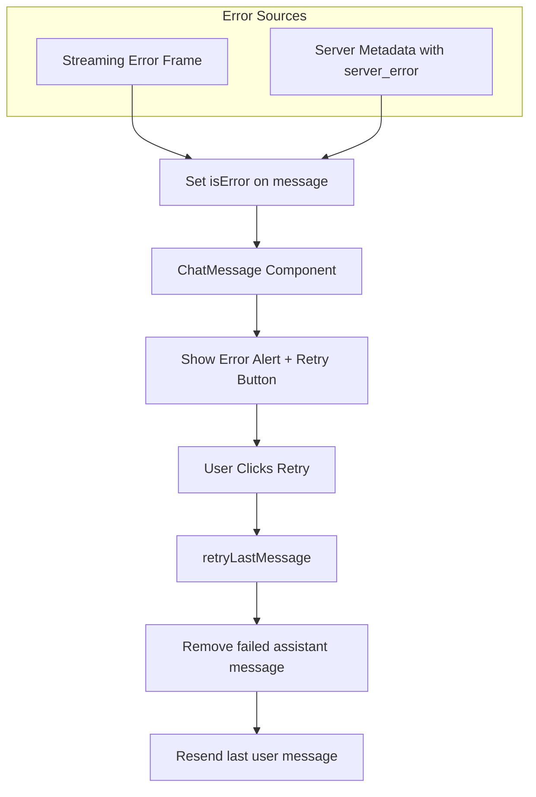

# Chat Error Handling and Retry Generation

## Current State

- **Backend**: When streaming errors occur, saves assistant message with `metadata: { done: false, done_reason: "server_error" }` and sends an `error` frame
- **Frontend**: Currently throws errors without UI feedback; metadata is stored but not used on the frontend

## Implementation

### 1. Update Types

In [`apps/frontend/src/types/chat.ts`](apps/frontend/src/types/chat.ts):

- Add `metadata?: string` to `ChatMessageServer` interface
- Add `isError?: boolean` to `ChatMessage` interface

### 2. Detect Failed Messages from Server

In [`apps/frontend/src/api/chatService.ts`](apps/frontend/src/api/chatService.ts) `getConversation`:

- Parse `metadata` field for assistant messages
- Set `isError: true` when metadata contains `done: false` and `done_reason: "server_error"`

### 3. Track Streaming Errors

In [`apps/frontend/src/queries/useChatStream.ts`](apps/frontend/src/queries/useChatStream.ts):

- Add `streamError` ref to track error state
- On `error` frame: set `isError: true` on the current assistant message instead of throwing
- Expose `streamError` and `clearError` from the composable

### 4. Wire Up Retry Functionality

In [`apps/frontend/src/composables/useChat.ts`](apps/frontend/src/composables/useChat.ts):

- Add `retryLastMessage()` function that:
  - Finds the last user message
  - Removes the failed assistant message from local state
  - Resends the user message
- Expose `streamError`, `retryLastMessage` from the composable

### 5. Display Error UI

In [`apps/frontend/src/components/chat/ChatMessage.vue`](apps/frontend/src/components/chat/ChatMessage.vue):

- Add `isError` prop
- When `isError && isAssistant`: show error alert with message and retry button
- Emit `retry` event when button clicked

In [`apps/frontend/src/components/chat/ChatMessages.vue`](apps/frontend/src/components/chat/ChatMessages.vue):

- Pass `isError` state to last assistant message
- Emit `retry` event upward

In [`apps/frontend/src/components/ChatView.vue`](apps/frontend/src/components/ChatView.vue):

- Handle `retry` event by calling `retryLastMessage()`

## Data Flow

