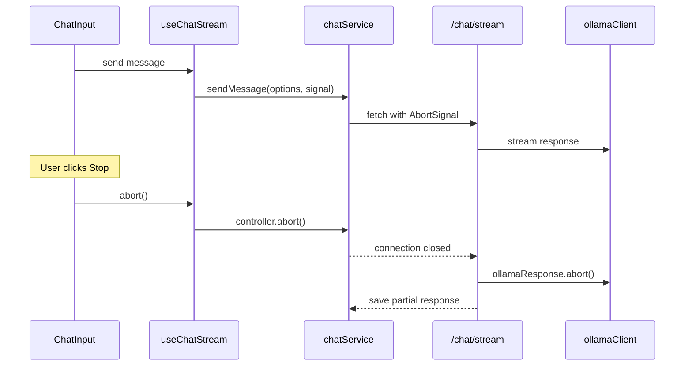

# Stop Generation Feature

## Summary

When streaming or awaiting a response, replace the send button with a stop button that aborts the current request and stops the backend generation.

## Architecture

## Changes

### 1. Frontend API Layer - [`apps/frontend/src/api/chatService.ts`](apps/frontend/src/api/chatService.ts)

- Add optional `signal: AbortSignal` parameter to `sendMessage()`
- Pass signal to `fetch()` call

### 2. Stream Hook - [`apps/frontend/src/queries/useChatStream.ts`](apps/frontend/src/queries/useChatStream.ts)

- Create an `AbortController` ref that persists across renders
- Pass `controller.signal` to `sendMessage()`
- Add `abort()` function that calls `controller.abort()` and resets streaming state
- Handle `AbortError` gracefully (not as an error to throw)

### 3. Chat Composable - [`apps/frontend/src/composables/useChat.ts`](apps/frontend/src/composables/useChat.ts)

- Expose `stopGeneration` from `useChatStream`

### 4. Chat View - [`apps/frontend/src/components/ChatView.vue`](apps/frontend/src/components/ChatView.vue)

- Pass `stopGeneration` function to `ChatInput`

### 5. Chat Input - [`apps/frontend/src/components/chat/ChatInput.vue`](apps/frontend/src/components/chat/ChatInput.vue)

- Add `@stop` emit and `stopGeneration` handler
- When `isStreaming` is true, show a stop button (square icon) instead of send/mic button

### 6. Backend - [`apps/backend/src/routes/chat.ts`](apps/backend/src/routes/chat.ts)

- Add `req.on('close', ...)` listener to detect client disconnection
- When client disconnects, call `ollamaResponse.abort()` and save partial response
